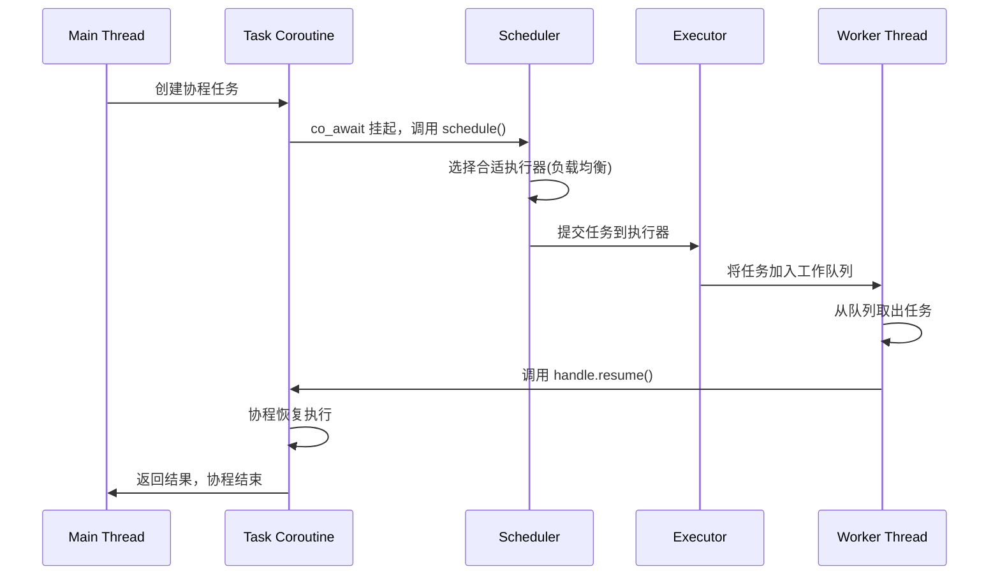
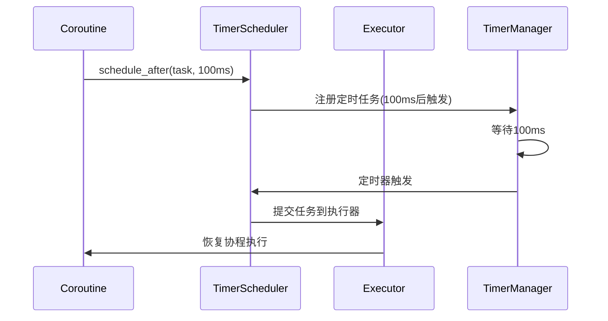

基于C++协程中Executor和Scheduler的设计模式，我为你设计了一套完整的协程库架构，包含API、时序图、接口继承关系和目录结构。

# 🏗️ 协程库整体架构设计

## 1. 目录结构设计

```
coro_lib/
├── include/corolib/
│   ├── core/                    # 核心组件
│   │   ├── executor.h          # 执行器抽象接口
│   │   ├── scheduler.h         # 调度器抽象接口
│   │   ├── task.h              # 协程任务模板
│   │   ├── fiber.h             # 有栈协程实现
│   │   └── coroutine.h         # 无栈协程支持
│   ├── executors/              # 具体执行器实现
│   │   ├── thread_pool_executor.h
│   │   ├── new_thread_executor.h
│   │   ├── looper_executor.h
│   │   └── shared_executor.h
│   ├── schedulers/             # 具体调度器实现
│   │   ├── round_robin_scheduler.h
│   │   ├── priority_scheduler.h
│   │   └── timed_scheduler.h
│   └── utils/
│       ├── timer_manager.h
│       └── io_manager.h
├── src/
│   ├── core/
│   ├── executors/
│   ├── schedulers/
│   └── utils/
└── examples/
    ├── echo_server.cpp
    └── task_demo.cpp
```

## 2. 接口继承关系设计

### 类图概览
```
AbstractExecutor(接口)        AbstractScheduler(接口)
         ↑                           ↑
    ┌─────┴─────┐               ┌─────┴─────┐
    │           │               │           │
ThreadPoolExecutor  LooperExecutor  TimerScheduler  PriorityScheduler
    │           │               │           │
    └─────┬─────┘               └─────┬─────┘
          │                           │
    Task<Result, Executor> ────→ 调度器管理执行器
```

## 3. 核心API设计

### 3.1 抽象执行器接口 (AbstractExecutor)
```cpp
// include/corolib/core/executor.h
class AbstractExecutor {
public:
    virtual ~AbstractExecutor() = default;

    // 提交任务到执行器
    virtual void execute(std::function<void()>&& func) = 0;

    // 关闭执行器
    virtual void shutdown(bool wait_complete = true) = 0;

    // 获取执行器名称
    virtual std::string name() const = 0;

    // 检查是否正在运行
    virtual bool is_running() const = 0;
};
```

### 3.2 抽象调度器接口 (AbstractScheduler)
```cpp
// include/corolib/core/scheduler.h
class AbstractScheduler {
public:
    virtual ~AbstractScheduler() = default;

    // 添加执行器到调度池
    virtual void add_executor(std::shared_ptr<AbstractExecutor> executor) = 0;

    // 移除执行器
    virtual void remove_executor(std::shared_ptr<AbstractExecutor> executor) = 0;

    // 调度任务到合适的执行器
    virtual void schedule(std::function<void()>&& task,
                          ScheduleStrategy strategy = ScheduleStrategy::ANY) = 0;

    // 延迟调度
    virtual void schedule_after(std::function<void()>&& task,
                               std::chrono::milliseconds delay,
                               ScheduleStrategy strategy = ScheduleStrategy::ANY) = 0;

    enum class ScheduleStrategy {
        ANY,           // 任意执行器
        LOAD_BALANCE,  // 负载均衡
        SPECIFIC       // 指定执行器
    };
};
```

### 3.3 协程任务模板 (Task)
```cpp
// include/corolib/core/task.h
template<typename ResultType, typename Executor = ThreadPoolExecutor>
class Task {
public:
    using promise_type = TaskPromise<ResultType, Executor>;

    // 协程句柄
    bool await_ready() const noexcept { return false; }

    template<typename UExecutor>
    void await_suspend(std::coroutine_handle<> handle, UExecutor* executor) {
        // 挂起时调度到指定执行器
        task_.finally( {
            executor->execute( {
                handle.resume();
            });
        });
    }

    ResultType await_resume() {
        return task_.get_result();
    }

private:
    Task<ResultType, Executor> task_;
};
```

## 4. 具体实现类

### 4.1 线程池执行器 (ThreadPoolExecutor)
```cpp
// include/corolib/executors/thread_pool_executor.h
class ThreadPoolExecutor : public AbstractExecutor {
public:
    explicit ThreadPoolExecutor(size_t num_threads);

    void execute(std::function<void()>&& func) override;
    void shutdown(bool wait_complete = true) override;

    // 获取线程池状态
    size_t pending_tasks() const;
    size_t active_threads() const;

private:
    std::vector<std::thread> workers_;
    std::queue<std::function<void()>> tasks_;
    std::mutex queue_mutex_;
    std::condition_variable condition_;
    bool stop_ = false;
};
```

### 4.2 事件循环执行器 (LooperExecutor)
```cpp
// include/corolib/executors/looper_executor.h
class LooperExecutor : public AbstractExecutor {
public:
    LooperExecutor();
    ~LooperExecutor();

    void execute(std::function<void()>&& func) override;

private:
    void run_loop();

    std::thread worker_thread_;
    std::queue<std::function<void()>> tasks_;
    std::mutex queue_mutex_;
    std::condition_variable condition_;
    std::atomic<bool> active_{true};
};
```

### 4.3 定时调度器 (TimerScheduler)
```cpp
// include/corolib/schedulers/timed_scheduler.h
class TimerScheduler : public AbstractScheduler {
public:
    void schedule_after(std::function<void()>&& task,
                      std::chrono::milliseconds delay,
                      ScheduleStrategy strategy) override {

        // 使用优先级队列管理定时任务
        auto scheduled_time = std::chrono::steady_clock::now() + delay;
        delayed_tasks_.emplace(scheduled_time, std::move(task));

        // 通知调度线程
        condition_.notify_one();
    }

private:
    std::priority_queue<DelayedTask> delayed_tasks_;
};
```

## 5. 时序图设计

### 5.1 协程任务调度时序



### 5.2 延迟调度时序



## 6. 完整使用示例

```cpp
// examples/echo_server.cpp
#include "corolib/core/task.h"
#include "corolib/executors/thread_pool_executor.h"
#include "corolib/schedulers/round_robin_scheduler.h"

// 使用线程池执行器的异步任务
Task<int, ThreadPoolExecutor> async_multiply(int a, int b) {
    debug("Calculating {} * {} on thread: {}", a, b, std::this_thread::get_id());
    co_await 100ms; // 模拟异步操作
    co_return a * b;
}

// 使用事件循环执行器的任务
Task<void, LooperExecutor> event_loop_task() {
    debug("Running on looper thread: {}", std::this_thread::get_id());
    co_return;
}

int main() {
    // 创建执行器和调度器
    auto thread_pool = std::make_shared<ThreadPoolExecutor>(4);
    auto looper = std::make_shared<LooperExecutor>();

    RoundRobinScheduler scheduler;
    scheduler.add_executor(thread_pool);
    scheduler.add_executor(looper);

    // 提交任务
    auto task1 = async_multiply(6, 7);
    auto task2 = event_loop_task();

    // 等待任务完成
    auto result = task1.get_result();
    debug("Result: {}", result);

    return 0;
}
```

## 7. 关键设计要点

### 7.1 职责分离
- **执行器(Executor)**: 专注于"在哪里执行"，管理具体的执行资源（线程池、事件循环等）
- **调度器(Scheduler)**: 专注于"何时执行"，决定任务的执行时机和顺序

### 7.2 灵活的组合
通过模板参数将执行器与任务解耦，允许灵活组合：
```cpp
Task<int, ThreadPoolExecutor>  // 在线程池执行
Task<void, LooperExecutor>     // 在事件循环执行
Task<string, NewThreadExecutor> // 在新线程执行
```

### 7.3 性能优化
- 使用无锁队列减少同步开销
- 支持工作窃取(work-stealing)提高负载均衡
- 延迟调度避免不必要的上下文切换

这套设计提供了高度的灵活性和可扩展性，你可以基于这些接口实现更多特定场景的执行器和调度器。