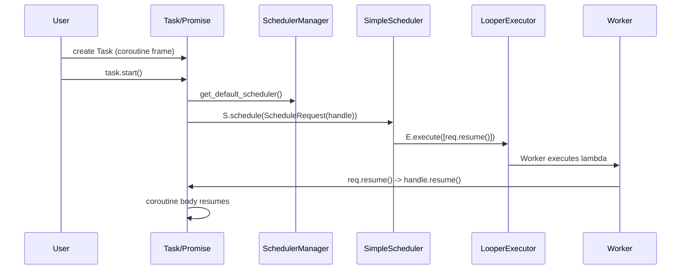

# Koroutine — 实现级架构说明

本文件面向项目维护者与贡献者，提供与当前源码严格对齐的实现级架构说明：目录映射、核心类型与接口、任务生命周期时序、调度/执行路径、以及常见扩展点与注意事项。

**仓库（精简视图）：**

```
.
├── CMakeLists.txt
├── cmakes/
├── demos/
├── docs/
├── include/
│   └── koroutine/
│       ├── async_io/
│       ├── awaiters/
│       ├── executors/
│       ├── schedulers/
│       ├── sync/
│       ├── task.hpp
│       ├── task_promise.hpp
│       ├── runtime.hpp
│       ├── scheduler_manager.h
│       └── when_all.hpp / when_any.hpp
├── scripts/
└── src/
    └── scheduler_manager.cpp
```

**目标**

- 帮助贡献者快速定位实现位置（文件 ↔ 概念）；
- 明确任务从创建到恢复的关键调用链与责任划分；
- 指出可插拔拓展点（Executor、Scheduler、Awaiter、IO 引擎）；
- 提供实现/ABI 稳定性的注意事项与未来兼容建议。

---

## 核心概念与实现位置

- **Task<T> / Task<void>** — `include/koroutine/task.hpp`
  - 持有 `std::coroutine_handle<promise_type>`。公开 `start()`、`operator co_await`/`await_transform`（在 promise 中定制）。

- **TaskPromise** — `include/koroutine/task_promise.hpp`
  - 管理 `initial_suspend` / `final_suspend`、结果/异常存储、以及在 `await_transform` 中生成自定义 awaiter。负责将继续逻辑（continuation）交给调度器或执行器。

- **ScheduleRequest** — `include/koroutine/schedulers/schedule_request.hpp`
  - 轻量包装：包含 `std::coroutine_handle<> handle_` 与 `ScheduleMetadata`（如优先级、tag 等）。提供 `resume()` 和显式有效性检测。

- **AbstractScheduler** — `include/koroutine/schedulers/scheduler.h`
  - 抽象接口：`schedule(ScheduleRequest, uint64_t delay_ms = 0)`。决定何时/如何调用 `ScheduleRequest::resume()`。

- **SimpleScheduler** — `include/koroutine/schedulers/SimpleScheduler.h`
  - 默认实现。内部持有一个 `LooperExecutor`（事件循环执行器），对 `ScheduleRequest` 做立即或延迟的交付：
    - `delay_ms==0` -> `_executor->execute([req=move(request)](){ req.resume(); })`
    - `delay_ms>0` -> `_executor->execute_delayed(..., delay_ms)`

- **Executors（执行器）** — `include/koroutine/executors/*.h`
  - 职责：“怎样执行一个函数”。常见：`LooperExecutor`（事件循环）、`NewThreadExecutor`（新线程）、`AsyncExecutor`（基于 std::async）。接口最小：`execute(fn)`，可选：`execute_delayed(fn, ms)`。

- **SchedulerManager** — `include/koroutine/scheduler_manager.h` / `src/scheduler_manager.cpp`
  - 存储并返回全局默认调度器（`std::shared_ptr<AbstractScheduler>`）。允许通过 `set_default_scheduler()` 覆盖以实现全局策略切换。

- **Awaiters** — `include/koroutine/awaiters/`
  - 各种 awaiter 实现（task awaiter / I/O awaiter / channel awaiter / switch_executor awaiter 等）。部分 awaiter 会直接使用 `Executor` 来 resume（绕过 Scheduler），以降低延迟。

- **Runtime（同步入口）** — `include/koroutine/runtime.hpp`
  - 提供 `block_on(Task)`、`join_all` 等，用于在同步环境（如 `main()`) 启动并等待异步任务完成。`block_on` 使用条件变量将异步结果回传到调用线程。

- **Async I/O 抽象** — `include/koroutine/async_io/*`
  - 工厂函数根据平台选择实现（io_uring / kqueue / IOCP），并向上层提供 awaitable I/O 操作。

- **Channel / 同步原语** — `include/koroutine/channel.hpp`, `include/koroutine/sync/*`
  - 提供协程间通信、异步互斥与条件变量，小心处理关闭（close）以及待唤醒集合的遍历与异常传播。

---

## 任务生命周期与关键调用链（实现级）

下面描述任务从创建到最终销毁时的典型路径，严格对应当前实现：

1) 协程函数被调用，编译器生成 coroutine frame，返回 `Task`：
   - `Task` 包含 `coroutine_handle<promise_type>`，promise 在构造阶段初始化其内部状态（结果容器、异常存储、可能的 scheduler 引用）。

2) 调用 `Task::start()`（或 runtime wrapper 自动调用）：
   - `start()` 标记任务为已启动；从 promise 中获取已设置的 scheduler，如果未设置则调用 `SchedulerManager::get_default_scheduler()`；
   - 构造 `ScheduleRequest`（包装 `handle` 与 `metadata`），调用 `scheduler->schedule(request, 0)`。

3) `AbstractScheduler::schedule()`（默认 `SimpleScheduler`）接收请求：
   - `SimpleScheduler` 将请求交给其内部 `LooperExecutor`：
     - 无延迟 -> `_executor->execute(lambda{ req.resume(); })`
     - 有延迟 -> `_executor->execute_delayed(lambda{ req.resume(); }, delay_ms)`

4) `LooperExecutor` 将 lambda 放入工作队列，由工作线程或事件循环执行：
   - 工作线程取出 lambda 并执行 -> 调用 `ScheduleRequest::resume()` -> `coroutine_handle.resume()` -> 协程在该线程/上下文中继续执行。

5) 某些 awaiter 直接与 `Executor` 协作：
   - 例如 `switch_to(executor)` 的 awaiter：在 `await_suspend(handle)` 中调用 `executor->execute([handle]{ handle.resume(); })`，绕过 Scheduler，提供更直接的上下文切换路径。

6) 协程完成与清理：
   - `final_suspend()` 根据实现返回 `suspend_always` 或其它策略；资源（frame）通常由 `Task` 的析构或运行时显式 `handle.destroy()` 回收。

时序简图（简化）:



---

## 扩展点与实现建议

- 添加自定义 Executor：实现 `execute(fn)` / `execute_delayed(fn, ms)` 即可被 `SimpleScheduler` 或 awaiter 直接利用。注意线程安全与生命周期管理。

- 新的 Scheduler：继承 `AbstractScheduler`，实现更复杂的调度策略（优先级、延时队列、工作窃取等），并通过 `SchedulerManager::set_default_scheduler()` 切换。

- Awaiter：若需低延迟恢复，可让 awaiter 直接持有 `Executor` 并在 `await_suspend` 中调用 `executor->execute` 来 resume，而不是通过 `Scheduler`。

- Async IO 后端：在 `include/koroutine/async_io/` 增加平台实现，务必保证 awaitable 的 `await_suspend` 将完成回调通过适当的 Executor/ Scheduler resume 对应 coroutine handle。

---

## 与 ABI/未来兼容相关的注意事项

- 为了未来兼容（比如 C++26 的 `std::execution` 或其他标准化调度/执行抽象）：
  - 将库内部依赖的抽象限制在小而稳定的接口（`execute(fn)`, `schedule(request)`），并提供适配层（adapters）以桥接到 `std::execution` 或第三方执行器。
  - 避免在公共 ABI 中暴露模板化的具体实现细节，优先使用 `std::shared_ptr<AbstractScheduler>` / `std::unique_ptr<AbstractExecutor>` 等间接化指针类型以便替换实现。

- 单头发布 \(single-header\)：保持生成脚本 `scripts/generate_single_header.py` 的可用性，在合并实现时清楚列出需要内联或移除的实现细节，以减少用户端破坏性变更。

---

## 常见修改场景示例

- 将默认 `SimpleScheduler` 替换为基于线程池的 `PriorityScheduler`：实现 `PriorityScheduler` 继承 `AbstractScheduler` -> 在启动阶段 `set_default_scheduler(std::make_shared<PriorityScheduler>())` -> 所有 `Task::start()` 将自动使用新策略。

- 在 awaiter 中直接切换到特定线程池：编写 awaiter，在 `await_suspend` 中调用 `executor->execute([handle]{ handle.resume(); })`。

---

## 参考文件索引（快速跳转）

- 任务/Promise: `include/koroutine/task.hpp`, `include/koroutine/task_promise.hpp`
- 调度/请求: `include/koroutine/schedulers/scheduler.h`, `include/koroutine/schedulers/schedule_request.hpp`, `include/koroutine/schedulers/SimpleScheduler.h`
- 执行器: `include/koroutine/executors/looper_executor.h`, `include/koroutine/executors/new_thread_executor.h`, `include/koroutine/executors/async_executor.h`
- 管理: `include/koroutine/scheduler_manager.h`, `src/scheduler_manager.cpp`
- 运行时: `include/koroutine/runtime.hpp`
- Async I/O: `include/koroutine/async_io/*`

---

如果你希望，我可以：

- 生成一套更详细的序列图（按函数/文件逐层展开）；
- 把上述“参考文件索引”转换为 MkDocs 中每个头文件的链接（基于生成的 API 参考或手动页面）；
- 为关键路径（Task->Scheduler->Executor）添加微基准测试示例以验证延迟/吞吐。

结束。

